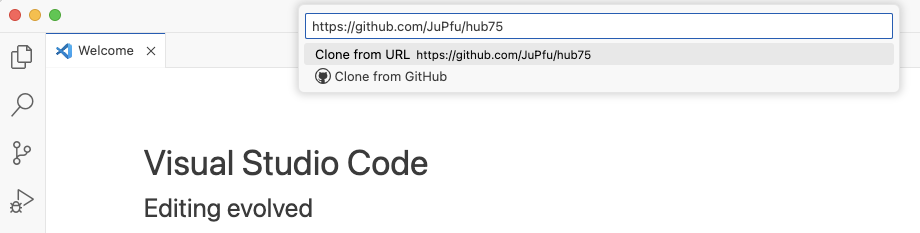
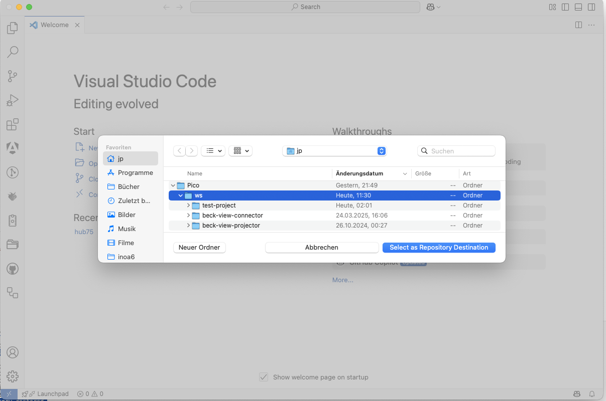
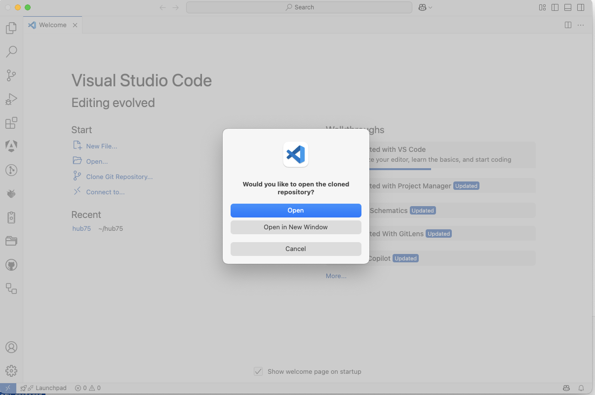
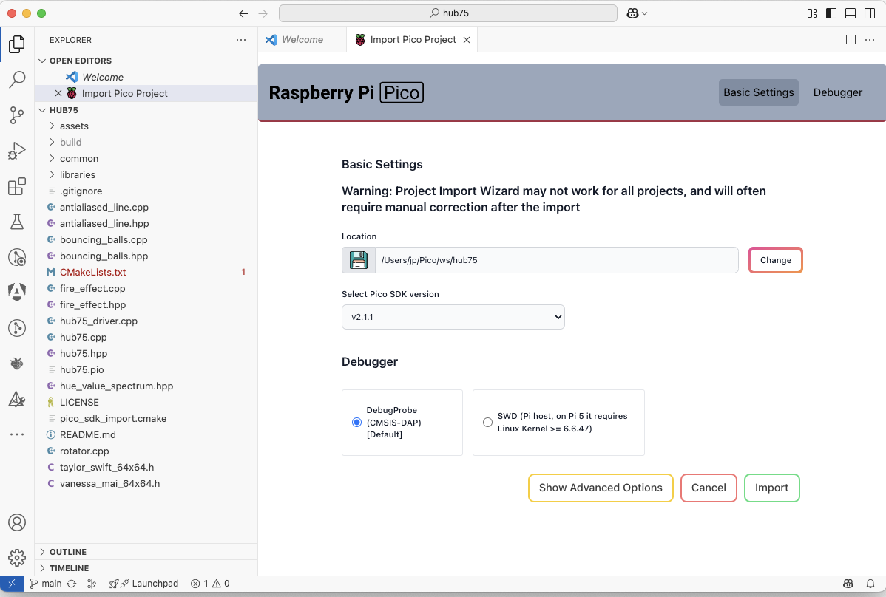
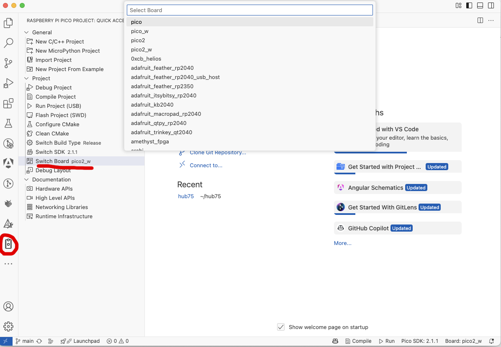
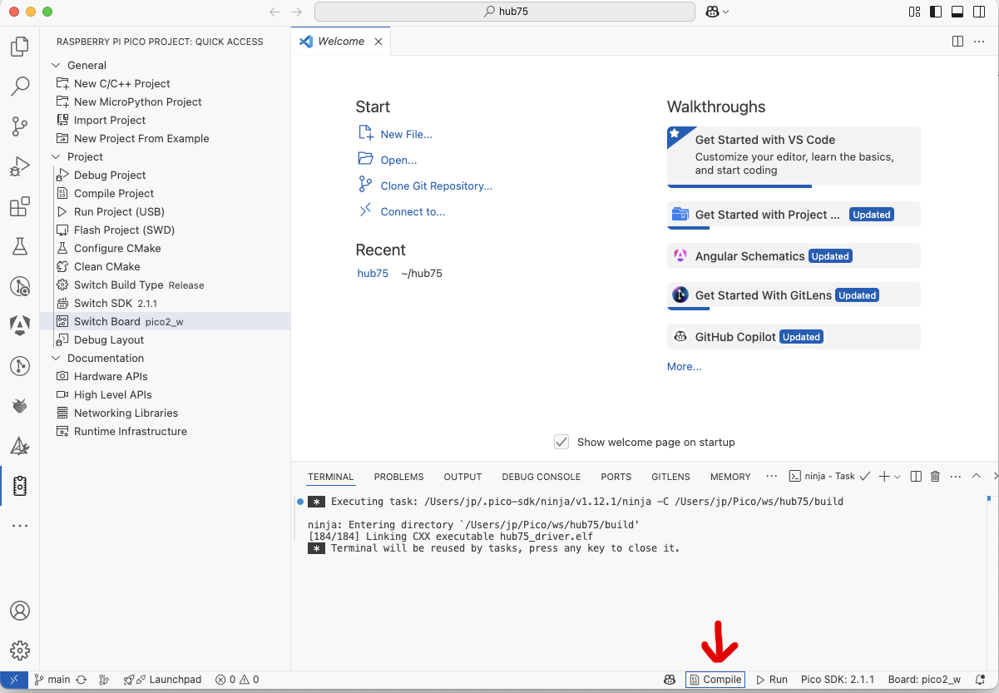

# LVGL Demo on Raspberry Pi Pico with Attached HUB75 RGB LED Matrix

This project demonstrates how to run [LVGL](https://lvgl.io/) on a Raspberry Pi Pico (RP2040 or RP2040-compatible microcontroller) to drive an attached HUB75 RGB LED matrix panel.


## Demo Effects

This project currently demonstrates three animated demos:

- 🎾 **Bouncing Balls** — includes circular horizontal scrolling text (15 sec)
- 🔥 **Fire Effect** — Animated flame using procedural effect (15 sec)
- 🖼️ **Image Animation** — Rotating static image for 360 degrees, then idle for 15 sec

✨ Transitions (fade or slide) are applied between demos.

---

## Project Goals and Focus

The LED matrix driver used in this project is an evolution of [Pimoroni's HUB75 driver](https://github.com/pimoroni/pimoroni-pico/tree/main/drivers/hub75) which leans on [Raspberry Pi's pico-examples/pio/hub75](https://github.com/raspberrypi/pico-examples). It is an optimised driver which boosts performance through self-paced, interlinked DMA and PIO processes. The LED Matrix driver implementation is described in detail in [Hub75](https://github.com/JuPfu/hub75). In this referenced project the examples utilise [Pimoronis Pico Graphics library](https://github.com/pimoroni/pimoroni-pico/tree/main/libraries/pico_graphics) to show the capabilities of the LED matrix driver. `Pimoronis Pico Graphics library` is a tiny graphics library ...
> which supports drawing text, primitive and individual pixels and includes basic types such as Rect and Point brimming with methods to help you develop games and applications.

The goal of this project is to substitute `Pimoronis Pico Graphics library` with the **[Light and Versatile Graphics Library](https://lvgl.io/)** (LVGL), which claims ... 
> to be the most popular free and open-source embedded graphics library to create beautiful UIs for any MCU, MPU and display type.


## Hardware Setup

- **Controller**: Raspberry Pi Pico (RP2040 or RP2040-compatible)
- **Display**: 64×64 HUB75 RGB LED matrix panel  
  > ⚠️ Other panel sizes can be supported with small adjustments
- **Power**: External 5V supply for the LED matrix is required

---

## Core Distribution Diagram

```plaintext
+----------------------+       +----------------------+
|        Core 0        |       |        Core 1        |
|                      |       |                      |
|  - LVGL              |       |  - HUB75 Driver      |
|  - Demo Effects      |       |                      |
+----------------------+       +----------------------+
```

The HUB75 driver runs on **core 1**, utilizing **PIO** and **DMA**, freeing up **core 0** for LVGL rendering and animation logic.

---

## Integrating LVGL into a Pico Project

1. **Download** the latest version of [LVGL](https://github.com/lvgl/lvgl)
2. **Extract** the zip and rename the folder to `lvgl`
3. **Copy** it into your project's top-level directory
4. **Configure LVGL**
   * Copy `lv_conf_template.h` to your top-level directory
   * Rename it to `lv_conf.h`
   * Modify it to match your needs (use this project as reference)

   Your directory structure should look similar to this
   ```bash
   lvgl/
   lv_conf.h
   other files and folders in your project, e.g. 
   CMakeLists.txt
   ```
5. **Add this snippet** to your `CMakeLists.txt`

   ```cmake
   # LVGL configuration
   message(NOTICE "===>>> LVGL configuration start ===")

   set(LVGL_DIR_NAME lvgl)
   set(LVGL_DIR ${CMAKE_CURRENT_LIST_DIR})
   set(LV_CONF_PATH ${CMAKE_CURRENT_LIST_DIR}/lv_conf.h)
   set(LV_CONF_INCLUDE_SIMPLE ${CMAKE_CURRENT_LIST_DIR}/lv_conf.h)

   message(NOTICE "LVGL folder name: ${LVGL_DIR_NAME}")
   message(NOTICE "Path to LVGL folder: ${LVGL_DIR}")
   message(NOTICE "Path to config file: ${LV_CONF_PATH}")
   message(NOTICE "Include path: ${LV_CONF_INCLUDE_SIMPLE}")

   add_subdirectory(${LVGL_DIR_NAME})

   message(NOTICE "=== LVGL configuration end <<<===")
   ```

   See the projects `CMakeLists.txt` for details.
6. Follow the [LVGL Integration Guide](https://docs.lvgl.io/master/details/integration/index.html)

---

## Connecting LVGL to the HUB75 Driver

To render LVGL output on the HUB75 panel, you need:

### 1. Millisecond Tick Source

```c
uint32_t get_milliseconds_since_boot()
{
    critical_section_enter_blocking(&crit_sec);
    uint32_t ms = to_ms_since_boot(get_absolute_time());
    critical_section_exit(&crit_sec);
    return ms;
}
```

### 2. Display Flush Callback

Connects LVGL's draw buffer to the HUB75 display. The parameter *area is not used as LGVL is directed to always pass the complete buffer of the display ([see Choose LV_DISPLAY_RENDER_MODE_FULL](#choose-lvdisplayrendermodefull)).

```c
void flush_cb(lv_display_t *display, const lv_area_t *area, uint8_t *px_map)
{
    update_bgr(px_map);              // Transfer buffer to HUB75 driver
    lv_display_flush_ready(display); // Notify LVGL that flush is complete
}
```

> `update_bgr()` is provided by the optimised [`hub75`](https://github.com/JuPfu/hub75) driver.


### 3. Choose LV_DISPLAY_RENDER_MODE_FULL

With `LV_DISPLAY_RENDER_MODE_DIRECT` the buffer size must match the size of the display. LVGL will render into the correct location of the buffer. Using this method the buffer always contain the whole display image.

```c
    lv_init();
    lv_tick_set_cb(get_milliseconds_since_boot);

    display1 = lv_display_create(RGB_MATRIX_WIDTH, RGB_MATRIX_HEIGHT);
    if (display1 == NULL)
    {
        printf("lv_display_create failed\n");
        return -1;
    }

    lv_display_set_buffers_with_stride(display1, buf1, NULL, sizeof(buf1), 64 * 3, LV_DISPLAY_RENDER_MODE_FULL);
    lv_display_set_flush_cb(display1, flush_cb);
```

### 4. Periodic Timer Handler Call

In your main loop, call `lv_timer_handler()`

```c
while (true)
{
    if (load_anim)
    {
        load_anim = false;
        setup_demo(frame_index, bouncingBalls, fireEffect, imageAnimation, timer);
    }

    update_demo(frame_index, bouncingBalls, fireEffect, imageAnimation, timer);

    lv_timer_handler();
    sleep_ms(frame_delay_ms / 2);
}
```


## Dependencies

* [LVGL](https://github.com/lvgl/lvgl)
* [hub75_lvgl](https://github.com/JuPfu/hub75_lvgl) (custom optimized driver)
* CMake build system (standard for Pico SDK projects)

---

## How to Use This Project in VSCode

You can easily use this project with VSCode, especially with the **Raspberry Pi Pico plugin** installed. Follow these steps:

1. **Open VSCode and start a new window**.
2. **Clone the repository**:
   - Press `Ctrl+Shift+P` and select `Git: Clone`.
   - Paste the URL: `https://github.com/JuPfu/hub75_lvgl`

      

   - Choose a local directory to clone the repository into.

       


3. **Project Import Prompt**:
   - Accept the prompt to open the project.

       

   - When prompted, "Do you want to import this project as Raspberry Pi Pico project?", click **Yes** or wait a few seconds until the dialog prompt disappears by itself.

4. **Configure Pico SDK Settings**:
   - A settings page will open automatically.
   - Use the default settings unless you have a specific setup.

       

   - Click **Import** to finalize project setup.
   - Switch the board-type to your Pico model.

       

5. **Wait for Setup Completion**:
   - VSCode will download required tools, the Pico SDK, and any plugins.

6. **Connect the Hardware**:
   - Make sure the HUB75 LED matrix is properly connected to the Raspberry Pi Pico.
   - Attach the Raspberry Pi Pico USB cable to your computer

7. **Build and Upload**:
   - Compiling the project can be done without a Pico attached to the computer.

       

   - Click the **Run** button in the bottom taskbar.
   - VSCode will compile and upload the firmware to your Pico board.

> 💡 If everything is set up correctly, your matrix should come to life with the updated HUB75 DMA driver.

---

## Next Steps

- **Add some more graphics examples** to explore the capabilities of LVGL on Pico.

## Support
Any contribution to the project is appreciated!

For any question or problem, feel free to open an issue!


## License

[MIT License](https://github.com/JuPfu/hub75#MIT-1-ov-file)

---

[](LICENSE)
[]()
[](https://lvgl.io/)

