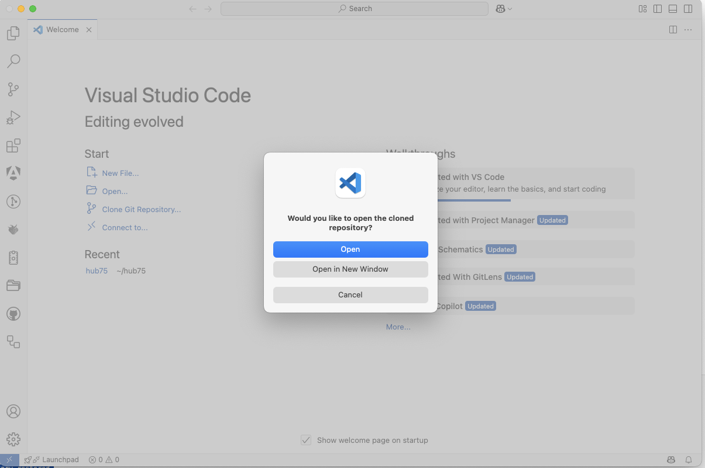

# LVGL Demo on Raspberry Pi Pico with Attached HUB75 RGB LED Matrix

This project demonstrates how to run [LVGL](https://lvgl.io/) on a Raspberry Pi Pico (RP2040 or RP2040-compatible microcontroller) to drive an attached HUB75 RGB LED matrix panel.

## Last Changes

I followed [cmair](https://github.com/cmair)'s suggestion to fetch (download) `LVGL` during the build process. This results in weaker coupling with `LVGL`. It also makes it easy to switch to a different version of `LVGL` by setting `LV_TAG` to the desired version in `CMakeLists.txt`, e.g., `set(LV_TAG v9.4.0)`.

## Demo Effects

This project currently demonstrates three animated demos:

- 🎾 **Bouncing Balls** — includes circular horizontal scrolling text (15 sec)
- 🔥 **Fire Effect** — Animated flame using procedural effect (15 sec)
- 🖼️ **Image Animation** — Rotating static image for 360 degrees, then idle for 15 sec

✨ Transitions (fade or slide) are applied between demos.

💡 At [reddit.com in the raspberrypipico group](https://www.reddit.com/r/raspberrypipico/comments/1kmegkv/lvgl_on_raspberry_pi_pico_driving_hub75_rgb_led/) a video shows the listed demo effects. The video is titled "LVGL on Raspberry Pi Pico driving HUB75 RGB LED Matrix".

---

## Project Goals and Focus

The LED matrix driver used in this project is an evolution of [Pimoroni's HUB75 driver](https://github.com/pimoroni/pimoroni-pico/tree/main/drivers/hub75) which leans on [Raspberry Pi's pico-examples/pio/hub75](https://github.com/raspberrypi/pico-examples). It is an optimised driver which boosts performance through self-paced, interlinked DMA and PIO processes. The LED Matrix driver implementation is described in detail in [Hub75](https://github.com/JuPfu/hub75). In this referenced project the examples utilise [Pimoroni's Pico Graphics library](https://github.com/pimoroni/pimoroni-pico/tree/main/libraries/pico_graphics) to show the capabilities of the LED matrix driver. `Pimoroni's Pico Graphics library` is a tiny graphics library ...
> which supports drawing text, primitive and individual pixels and includes basic types such as Rect and Point brimming with methods to help you develop games and applications.

The goal of this project is to substitute `Pimoroni's Pico Graphics library` with the **[Light and Versatile Graphics Library](https://lvgl.io/)** (LVGL), which claims ...
> to be the most popular free and open-source embedded graphics library to create beautiful UIs for any MCU, MPU and display type.

## Hardware Setup

- **Controller**: Raspberry Pi Pico (RP2040 or RP2040-compatible)
- **Display**: 64×64 HUB75 RGB LED matrix panel  
  > ⚠️ Other panel sizes can be supported with small adjustments
- **Power**: External 5V supply for the LED matrix is required

---

## Core Distribution Diagram

```plaintext
+----------------------+       +----------------------+
|        Core 0        |       |        Core 1        |
|                      |       |                      |
|  - LVGL              |       |  - HUB75 Driver      |
|  - Demo Effects      |       |                      |
+----------------------+       +----------------------+
```

By default the HUB75 driver runs on **core 1**, utilizing **PIO** and **DMA**, freeing up **core 0** for LVGL rendering and animation logic. You can move the HUB75 driver to **core 0** by setting

```make
target_compile_definitions(hub75_lvgl PRIVATE
   ...
   HUB75_MULTICORE=false
   ...
)
```
in file `CMakeLists.txt`.

---

## Building the Project

This section walks through everything needed to go from a fresh clone to a flashable `.uf2` file — whether you prefer the command line or VSCode.

This project depends on **two** external libraries, both fetched automatically at configure time — you don't need to install or clone either yourself:

- **[LVGL](https://github.com/lvgl/lvgl)** — the graphics library, version pinned by `LV_TAG` in `CMakeLists.txt`.
- **[hub75](https://github.com/JuPfu/hub75)** — the underlying HUB75 LED matrix driver this project builds on, version pinned by `HUB75_TAG` in `CMakeLists.txt`.

### What happens during a build (in plain words)

Building this project involves four things that happen automatically, so you normally don't need to set anything up by hand:

1. **The Raspberry Pi Pico SDK** is located (or downloaded if missing).
2. **LVGL** is downloaded once and cached.
3. **hub75** is downloaded once and cached. Its `cie.py` utility also runs once to generate `cie.hpp` (the colour-correction lookup table used by the driver).
4. **CMake** generates build files, and **Ninja** compiles everything into `build/hub75_lvgl.uf2`.

Steps 1–3 only take noticeable time on the **very first build**. LVGL and hub75 are both cached in a persistent `.deps/` folder that lives *outside* `build/`, so deleting `build/` for a clean rebuild does **not** force either dependency to be re-cloned from GitHub — only deleting `.deps/` does that.

> 📡 **You need an internet connection for the first build**, since both LVGL and hub75 are fetched from GitHub.

Two ways to build the project are available:

- **Option A** — the `build.sh` script (command line), which also exposes a couple of extra configuration options for managing the build and dependency cache.
- **Option B** — VSCode with the Raspberry Pi Pico extension, as before.

---

### Option A — Build from the Command Line (macOS / Linux) using `build.sh`

```bash
git clone https://github.com/JuPfu/hub75_lvgl
cd hub75_lvgl
./build.sh
```

`build.sh` wraps the CMake/Ninja invocation and lets you decide how to handle an existing build or dependency cache, rather than always wiping everything:

| Flag | Effect |
|---|---|
| *(none)* | Reuses an existing `build/` directory if present, or creates one if it doesn't exist. Prompts before removing anything. |
| `-f`, `--fresh` | Removes `build/` before configuring. You'll then be asked whether to also clear `.deps/` (this forces a full re-clone of LVGL **and** hub75 — only do this if you actually need the latest sources or suspect a stale cache). |
| `-h`, `--help` | Shows usage. |

Under the hood, once those decisions are made, it runs:

```bash
cmake -S . -B build -G Ninja   # configure the project, fetch LVGL & hub75 if needed
cmake --build build -j<ncpu>   # compile everything, using all available CPU cores
```

While `cmake` runs for the first time, you'll see output showing LVGL and hub75 being downloaded — this is normal and may take 1–2 minutes depending on your connection. Subsequent runs skip this step entirely, even after wiping `build/`, since the sources live separately in `.deps/`.

When the build finishes successfully, you'll find the firmware here:

```
build/hub75_lvgl.uf2
```

#### Flashing the firmware

Connect your Pico in BOOTSEL mode (hold the BOOTSEL button while plugging it in), then run:

```bash
picotool load -f -x ./build/hub75_lvgl.uf2
```

> 🐧 Not yet tested on Linux, but it should work the same way. If you try it, feedback is welcome!

---

### Option B — Build with VSCode

If you'd rather use a graphical interface, VSCode with the **Raspberry Pi Pico extension** handles most of this for you — including fetching both LVGL and hub75. There's nothing extra to configure compared to Option A; the same two dependencies are fetched behind the scenes.

**1. Clone the repository**

- Press `Ctrl+Shift+P` and select `Git: Clone`
- Paste the URL: `https://github.com/JuPfu/hub75_lvgl`

  

- Choose a local directory to clone into

  

**2. Accept the project import prompt**

When VSCode asks *"Do you want to import this project as Raspberry Pi Pico project?"*, click **Yes** (or just wait — it proceeds automatically after a few seconds).

  

**3. Configure Pico SDK settings**

A settings page opens automatically. The default settings work fine for most setups.

  

- Click **Import** to finish setup
- Switch the board type to match your Pico model (e.g. Pico, Pico 2)

  

**4. Wait for setup to complete**

VSCode downloads the Pico SDK, toolchain, and extension dependencies. A status message ("Activating content...") shows this is in progress — this can take a few minutes the first time.

**5. Connect your hardware**

- Wire up the HUB75 LED matrix to your Pico
- Plug the Pico into your computer via USB

**6. Build and upload**

Click the **Run** button in the bottom status bar.

  

> ⏳ **The first build takes longer** — LVGL and hub75 are both downloaded during this step. You'll see progress messages in the **Output** panel (select the *CMake/Build* channel). Every build after that is much faster, since both are already cached locally in `.deps/`.

If everything is wired up correctly, your LED matrix should light up with the demo animations! 🎉

---

### Troubleshooting the Build

| Symptom | Likely cause / fix |
|---|---|
| First build hangs at "Activating content" | This is normal — LVGL and hub75 are being downloaded. Check the **Output → CMake/Build** panel for progress. |
| `fatal error: lvgl/...: No such file or directory` | LVGL include paths changed — make sure source files use `#include "lvgl.h"`. |
| `fatal error: hub75.hpp: No such file or directory` | hub75 wasn't fetched or populated correctly. Run `./build.sh --fresh` and clear `.deps/` when prompted to force a re-fetch. |
| CMake errors about duplicate `lvgl` targets | Run `./build.sh --fresh` and reconfigure — a stale `build/` directory can conflict with a fresh LVGL fetch. For VSCode manualy create a new build directory before compiling again. |
| Build suddenly breaks after a `git pull`, with no local changes | `HUB75_TAG` tracks hub75's `main` branch by default, so an upstream change there can affect this project without warning. Pin `HUB75_TAG` to a known-good tag or commit if you need a stable build (see [Switching the hub75 version](#switching-the-hub75-version)). |
| Build seems stuck with no output | Try running from the command line (`./build.sh`) instead, where progress is more visible. |

---

## Integrating a Different LVGL or Hub75 Version

Both dependencies are fetched via CMake's `FetchContent`, and each has its own version pin near the top of `CMakeLists.txt`.

### Switching the LVGL version

Currently **LVGL v9.5.0** is integrated into the project. To switch to a different version:

1. **Set the LVGL version** — edit the `LV_TAG` variable in `CMakeLists.txt` to the tag 🏷️ of the version you want (e.g. `v9.4.0`). Valid tags are listed on the [LVGL Releases page](https://github.com/lvgl/lvgl/releases).

2. **Update `lv_conf.h`** for the new version:
   - After a build, copy `lv_conf_template.h` from `.deps/lvgl-src/` to the project's top-level directory
   - Rename it to `lv_conf.h`
   - Adjust settings to match your needs (use the existing `lv_conf.h` in this project as a reference)

3. **Rebuild** — run `./build.sh` again. The new LVGL version will be fetched automatically.

### Switching the hub75 version

The LED matrix driver itself lives in its own repository, [hub75](https://github.com/JuPfu/hub75), and is pinned independently of LVGL via the `HUB75_TAG` variable in `CMakeLists.txt`:

```cmake
# Specify a tag from the hub75 project to fall back to a specific version
# set(HUB75_TAG v4.0.0)
# Set HUB75_TAG to main to compile with the latest version
set(HUB75_TAG main)
```

To switch versions:

1. **Set the hub75 version** — edit `HUB75_TAG` to a released tag (see the [hub75 tags](https://github.com/JuPfu/hub75/tags)) or a specific commit hash for full reproducibility. Tracking `main` gets you the latest driver features immediately, but it can also pull in breaking changes without warning — pin a tag for anything beyond local experimentation.

2. **Force a re-fetch** — run `./build.sh --fresh` and confirm clearing `.deps/` when prompted, so the new `HUB75_TAG` is actually picked up rather than reusing the cached checkout.

3. **Check `hub75_lvgl.cpp` still matches the driver's API** — hub75 exposes the panel's screen dimensions and rotation handling via the `HUB75_SCREEN_WIDTH`/`HUB75_SCREEN_HEIGHT` macros (see [Integrating LVGL with the Hub75 Driver](#integrating-lvgl-with-the-hub75-driver) below). A driver update that changes these macros, the `update_bgr()` signature, or panel-configuration defines may require small adjustments here.

Your directory structure should look like this:

```bash
.deps        # cached LVGL & hub75 sources — persists across clean builds
assets
build
examples
src
utils
build.sh
CMakeLists.txt
hub75_lvgl.cpp
lv_conf.h
README.md
```

---

## Integrating LVGL with the Hub75 Driver

The steps below describe how **LVGL** is connected to the **[hub75](https://github.com/JuPfu/hub75)** driver in this project. This can be the basis for your own modifications.

### 1. Millisecond Tick Source

```c
uint32_t get_milliseconds_since_boot()
{
    critical_section_enter_blocking(&crit_sec);
    uint32_t ms = to_ms_since_boot(get_absolute_time());
    critical_section_exit(&crit_sec);
    return ms;
}
```

### 2. Display Flush Callback

Connects LVGL's draw buffer to the HUB75 display. The `area` parameter is not used, since LVGL is configured to always pass the complete display buffer (see [Choose LV_DISPLAY_RENDER_MODE_FULL](#3-choose-lv_display_render_mode_full)).

```c
void flush_cb(lv_display_t *display, const lv_area_t *area, uint8_t *px_map)
{
    update_bgr(px_map);              // Transfer buffer to the hub75 driver
    lv_display_flush_ready(display); // Notify LVGL that flush is complete
}
```

> `update_bgr()` is provided by the [`hub75`](https://github.com/JuPfu/hub75/blob/main/src/hub75.cpp) driver. It's used here instead of the PicoGraphics-facing `update()` because this project sets `USE_PICO_GRAPHICS=false` in `CMakeLists.txt` — LVGL supplies the pixel data directly, so PicoGraphics isn't part of the pipeline.

### 3. Choose LV_DISPLAY_RENDER_MODE_FULL

With `LV_DISPLAY_RENDER_MODE_FULL`, the buffer size must match the size of the display, and LVGL renders directly into the correct location of that buffer. The buffer therefore always contains the complete display image.

Size the LVGL display and buffer using `HUB75_SCREEN_WIDTH`/`HUB75_SCREEN_HEIGHT` — **not** the raw `MATRIX_PANEL_WIDTH`/`MATRIX_PANEL_HEIGHT`. These macros are defined by the hub75 driver and already account for panel chaining (`CHAIN_COLS`/`CHAIN_ROWS`) as well as `DISPLAY_ROTATION`: for a 90°/270° rotation they're swapped relative to the panel's physical width/height, matching the *logical*, already-rotated frame that the driver expects LVGL to draw into. Using `MATRIX_PANEL_WIDTH`/`HEIGHT` directly only happens to work for a single, unrotated panel — it gives the wrong buffer size for anything chained or rotated.

```c
#define BYTES_PER_PIXEL (LV_COLOR_FORMAT_GET_SIZE(LV_COLOR_FORMAT_RGB888))

static uint8_t buf1[HUB75_SCREEN_WIDTH * HUB75_SCREEN_HEIGHT * BYTES_PER_PIXEL];

lv_init();
lv_tick_set_cb(get_milliseconds_since_boot);

display1 = lv_display_create(HUB75_SCREEN_WIDTH, HUB75_SCREEN_HEIGHT);
if (display1 == NULL)
{
    printf("lv_display_create failed\n");
    return -1;
}

lv_display_set_buffers_with_stride(display1, buf1, NULL, sizeof(buf1),
                                    HUB75_SCREEN_WIDTH * BYTES_PER_PIXEL,
                                    LV_DISPLAY_RENDER_MODE_FULL);
lv_display_set_flush_cb(display1, flush_cb);
```

> ⚠️ Don't additionally call `lv_display_set_rotation()` — hub75 already handles rotation internally via `HUB75_SCREEN_WIDTH`/`HUB75_SCREEN_HEIGHT` and its own pixel remapping (`DISPLAY_ROTATION` in `CMakeLists.txt`). Calling both would rotate the image twice.

### 4. Periodic Timer Handler Call

In your main loop, call `lv_timer_handler()`:

```c
while (true)
{
    if (load_anim)
    {
        load_anim = false;
        setup_demo(frame_index, bouncingBalls, fireEffect, imageAnimation, timer);
    }

    update_demo(frame_index, bouncingBalls, fireEffect, imageAnimation, timer);

    lv_timer_handler();
    sleep_ms(frame_delay_ms);
}
```

## Dependencies

- [LVGL](https://github.com/lvgl/lvgl) — graphics library, version pinned via `LV_TAG`
- [hub75](https://github.com/JuPfu/hub75) — HUB75 LED matrix driver, version pinned via `HUB75_TAG`
- CMake build system (standard for Pico SDK projects)

---

## Tested Hardware

⚠️ The examples contained in `hub75_lvgl.cpp` have been tested with a Raspberry Pi Pico 2 (RP2350). On a Raspberry Pi Pico (RP2040), you may need to comment out some demo effects due to its more limited memory.

Ask if you need support 🙂

---

## Next Steps

- **Add more graphics examples** to explore the capabilities of LVGL on Pico.

## Support

Any contribution to the project is appreciated!

For any question or problem, feel free to open an issue!

## License

[MIT License](https://github.com/JuPfu/hub75#MIT-1-ov-file)

---

[](LICENSE)
[]()
[](https://lvgl.io/)
